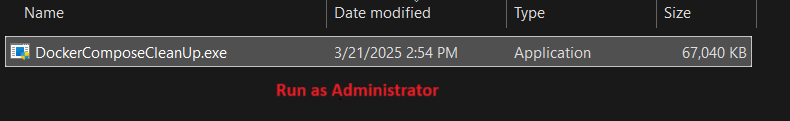
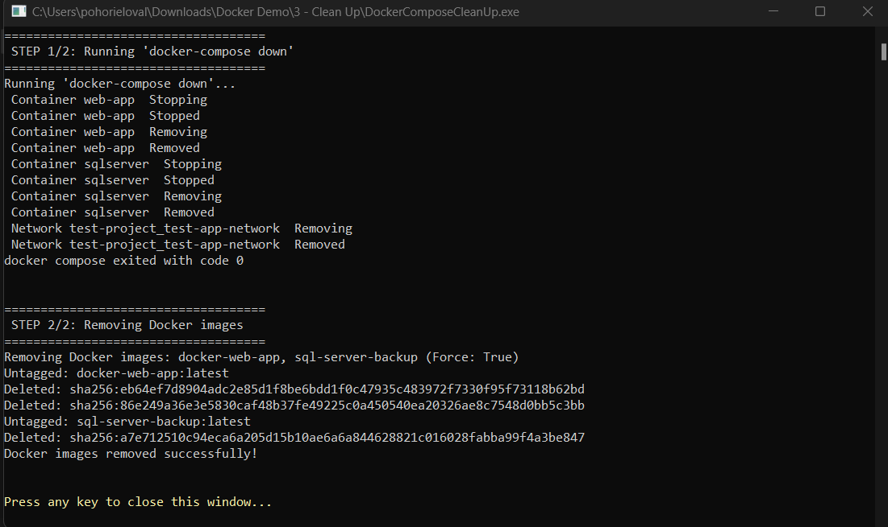

# Docker Compose Clean Up
This is a simple application to clean up after running docker-compose files. It will remove all the containers, images, and volumes created by the docker-compose file.

## Screenshots

